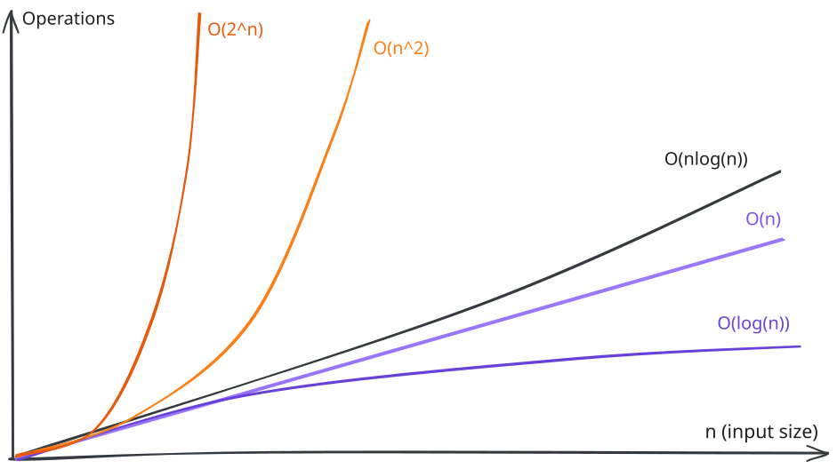

# Software Design CS Fundamentals - Algorithms

An algorithm is a set of instructions for getting from a specific input to a
desired output. Sorting a list, finding an element in a tree or computing a
route between two points: all of these have many possible recipes, and the
recipes are not interchangeable. Two algorithms that produce the same answer can
take very different amounts of time and memory to get there.

## Big O notation

When talking about and comparing algorithms, Big O notation is a central
concept. This notation describes the upper bound on how an algorithm's runtime
grows as a function of input size. That may sound very confusing, but it
typically answers the question: "When my input of size n (think array length)
doubles, what happens to the duration my code takes to finish? A runtime of
`O(n)` means that doubling the input roughly doubles the runtime. A runtime of
`O(n²)` means that doubling the input roughly quadruples the runtime (10² = 100
vs 20² = 400). A runtime of `O(1)` means the runtime does not depend on the
input at all and is often called constant time.

Big O describes the overall shape of this relation, not exact execution times.
An `O(n)` algorithm on a slow machine might be faster than an `O(log n)`
algorithm on a fast one, for some specific input. What Big O tells you is which
one wins as the input gets large. It is the right vocabulary for talking about
scale, and the wrong vocabulary for talking about a specific request on a
specific server.

The convention is to keep only the dominant term and drop constants. An
algorithm that takes `3n + 7` steps is `O(n)`. An algorithm that takes `n² + n`
steps is `O(n²)`. The reason is that as `n` grows, the largest term eventually
dominates everything else.



## Common complexity classes

A handful of classes show up over and over. Each one is paired below with a
typical example so the shape becomes recognizable.

- `O(1)`: a hash map lookup. Reading `users[id]` does not get slower as the map
  grows.
- `O(log n)`: a binary search on a sorted array. Each comparison cuts the
  remaining range in half.
- `O(n)`: a linear scan. Walking through every item in an array exactly once.
- `O(n log n)`: a good sorting algorithm. The best general-purpose sort cannot
  do better than this in the comparison-based model.
- `O(n²)`: a nested loop where each loop runs over the full input. Comparing
  every pair in a list.
- `O(2ⁿ)`: a naive recursive algorithm with two branches per call. Solving the
  unmodified Fibonacci recurrence is the classic example.

## Space complexity

Big O is also used for memory. The same notation describes how much extra memory
an algorithm needs as a function of input size. A linear scan that keeps a
running total uses `O(1)` extra memory regardless of input size. An algorithm
that builds a copy of the input uses `O(n)`.

Time and space are separate concerns, and an algorithm can be cheap on one and
expensive on the other. Caching is a recurring example where you trade a faster
execution for added memory usage.

## Sorting algorithms

To get a feeling for what distinguishes algorithms from another, lets take a
look at a couple of algorithms that all accomplish the same task but in
different ways: sorting a list of items.

### Bubble Sort

Bubble sort is the simplest sorting algorithm to describe and the easiest to
dismiss. Walk through the array comparing adjacent pairs. If a pair is out of
order, swap them. Repeat until a full pass produces no swaps. After each pass,
the largest remaining value has bubbled to the top, which is where the name
comes from.

The pseudo code for this algorithm reads like this:

```
repeat:
  swapped = false
  for i from 0 to length(arr) - 2:
    if arr[i] > arr[i+1]:
      swap arr[i] and arr[i+1]
      swapped = true
until not swapped
```

The outer loop runs another full pass whenever the previous pass had to swap
something. Once a pass goes through cleanly, the array is sorted and the loop
exits.

The runtime is `O(n²)`. In the worst case, an array sorted in reverse, every
value has to be moved past every other value. Bubble sort earns its place in the
curriculum not by being useful but by being the baseline that anchors what
`O(n²)` feels like in practice. Sorting a hundred items with bubble sort is
fine. Sorting a million items with bubble sort is not.

### Insertion sort

Insertion sort builds a sorted region at the front of the array, one element at
a time. Walk through the array starting from the second element. For each
element, slide it to the left past every larger element until it lands in the
right place among the already-sorted region. By the time the outer loop has
visited every element, the whole array is sorted.

The pseudo code for this algorithm reads like this:

```
for i from 1 to length(arr) - 1:
  current = arr[i]
  j = i - 1
  while j >= 0 and arr[j] > current:
    arr[j+1] = arr[j]
    j = j - 1
  arr[j+1] = current
```

The inner while loop shifts larger elements one position to the right to make
room. When it exits, the gap at `arr[j+1]` is the correct spot for `current`.

The worst case is `O(n²)`, on an array sorted in reverse, where every new
element has to be slid all the way to the front. The best case is `O(n)`, on an
already-sorted array, because the inner loop exits on the first comparison. That
sensitivity to how sorted the input already is makes insertion sort a strong
choice for small arrays and for arrays that are nearly sorted. It is also
in-place: aside from a single temporary variable, it needs no extra memory.

This is the reason TimSort uses insertion sort for the small chunks it has to
sort before merging them. On inputs of length 32 or so, a simple algorithm with
low constant factors beats anything fancier.

### Merge sort

With Merge sort things get a bit spicier: The strategy uses divide and conquer
in a recursive fashion. Split the array in half. Sort each half by applying
merge sort to it. Merge the two sorted halves into a single sorted array by
repeatedly taking the smaller of the two front elements. The recursion bottoms
out at arrays of length one, which are already sorted.

The pseudo code for this algorithm reads like this:

```
function mergeSort(arr):
  if length(arr) <= 1: return arr
  mid = length(arr) / 2
  left = mergeSort(arr[0..mid])
  right = mergeSort(arr[mid..end])
  return merge(left, right)

function merge(left, right):
  result = []
  while left and right both non-empty:
    if left[0] <= right[0]:
      remove the front of left and append to result
    else:
      remove the front of right and append to result
  append any remaining elements of left and right to result
  return result
```

`mergeSort` does the splitting and recursion. `merge` does the actual ordering
work, walking both sorted halves in parallel and always taking the smaller front
element next.

The runtime is `O(n log n)`. The `log n` factor comes from the splitting step,
which can only be repeated about `log₂ n` times before the pieces are size one.
The `n` factor comes from the merge step, which has to walk the whole array on
each level of the recursion. That product is the best general-purpose
comparison-based sorting can achieve.

The cost of merge sort is the extra memory it needs. Merging requires a
temporary buffer the size of the input, which makes its space complexity `O(n)`.

### Sorting in real engines

Very advanced and complex sorting algorithms typically have a large constant in
their time complexity, which is the part that is left out as discussed above.
That can give them the false image of always being the best choice. For smaller
arrays with roughly < 10000 entries simpler algorithms can actually be faster.

Therefore, JavaScript's `Array.prototype.sort` is not literally bubble sort or
merge sort. V8, the engine in Chrome and Node, uses TimSort, a hybrid that
combines merge sort with insertion sort and is tuned for inputs that are
partially sorted, which most real-world inputs are. Other engines have made
similar choices over the years.

## Resources

[Big-O Cheat Sheet](https://www.bigocheatsheet.com/)  
[Wikipedia: Timsort](https://en.wikipedia.org/wiki/Timsort)  
[Wikipedia: Merge sort](https://en.wikipedia.org/wiki/Merge_sort)  
[Sorting Algorithms visualized](https://www.cs.usfca.edu/~galles/visualization/ComparisonSort.html)  
[YT: Sorting Algorithms visualized](https://www.youtube.com/watch?v=kPRA0W1kECg)
