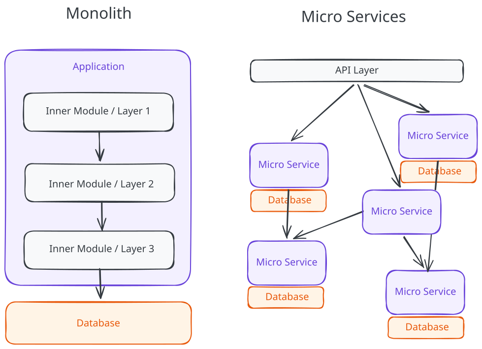
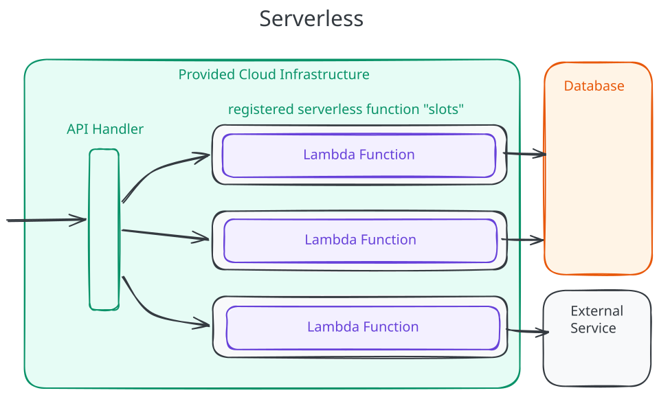
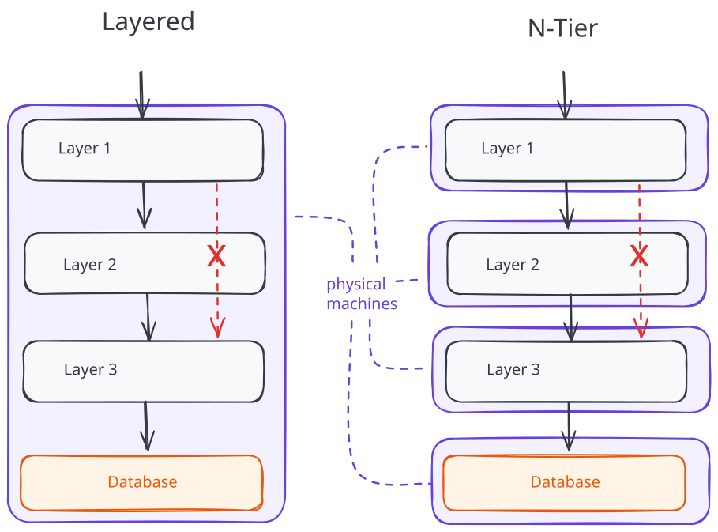

# Software Design CS Fundamentals - Architecture

Architecture in software answers one question: how are the parts of the system
connected? A request comes in from a user, code runs, data is read or written,
and pieces of the system have to talk to each other along the way. Architecture
patterns are named ways of arranging those pieces and the connections between
them.

Two ideas cut through the jargon. The first is that a pattern describes
connections, not features. It says where the boundaries are, what crosses them,
and what kind of channel is used: a function call, a network request, an event.
The second is that patterns apply at different scales. A whole product might be
one big process or a collection of services. Inside that process or service, the
code itself can be split into layers. A pattern at one scale does not lock you
out of a different pattern at a smaller or larger scale.

The four patterns covered here are monolith, microservices, serverless, and
layered (also called n-tier). They can operate at different granularities.
Monolith and microservices are about how the whole application is deployed.
Serverless is about whether code runs as a long-lived process or only when
something triggers it. Layered architecture is about separation of concerns and
which parts are allowed to talk to whom.

Real systems combine these. A typical web product has a backend that is often a
monolith internally organized in layers. Side workloads such as scheduled jobs,
webhook handlers, or image resizing can sit outside that monolith as serverless
functions. Many patterns can appear in the same application on different levels,
and recognizing which one is in play at which scale is more useful than trying
to pick a single label for the whole system.

Please be aware that the discussed architecture patterns are just a small
selection rather than an exhaustive list and its purpose is to learn that
systems can be designed in vastly different shapes.

## Monolith

A monolith is a single deployable unit that contains all of the application's
logic. One codebase, one build, one running application, one database. When a
request comes in, the same process handles authentication, business rules,
database access, and the response.

The connections between parts of a monolith are in-process function calls.
Everything lives in the same memory space, so sharing data is free, transactions
across modules use one database connection, and stepping through the code with a
debugger is straightforward. One test suite, one CI pipeline, one deploy.

The trade-offs show up at scale and at team size. A bug in one module can take
the whole application down because there is only one process to take down. Two
teams shipping at once have to coordinate the same release. If one part of the
system needs more memory or CPU, the whole process has to scale to give it to
them.

Monoliths have a reputation for being outdated but they are not. For a small
team or an early-stage product, a monolith is usually the correct starting
point, and splitting it up too early creates more problems than it solves.

## Microservices

A microservices architecture splits the application into a set of services, each
owning a bounded part of the domain along with its own data. Services talk to
each other over the network, usually through HTTP, gRPC or a message broker.
Each service can be developed, deployed, and scaled on its own. Each team can
own its service git repository, CI pipeline and internal architecture and even
the programming languages used in the code base.

The motivation comes from the pain of a large monolith. Two teams can ship
without coordinating a release because each owns its own service. A service that
needs more capacity can scale on its own without dragging the rest of the
application along. Different services can use different languages or databases
when that is a real win.

Microservices come with their own set of downsides. A network call can fail in
ways an in-process function call never could: timeouts, partial failures,
retries, duplicates. Data that used to live in one database now lives in
several, and consistency between them becomes the application's problem rather
than the database's. Observability and tracing the root cause of a bug becomes a
discipline of its own because a single user request now touches many services.

## Serverless

Serverless is an execution model in which the platform (Vercel, AWS, Google
etc.) provisions and scales the runtime for you. You write a function, register
it against a trigger such as an HTTP request, a queue message, or a cron
schedule, and the platform takes care of running it on demand. There is no
server to log in to and no process to keep alive between requests.

The appeal lines up with the model. You only pay for the time your code is
actually running, which is attractive for spiky or low-volume workloads. Scaling
is automatic from one invocation to thousands. There is no operating system to
patch and no idle process to size.

This model comes with its own set of trade-offs. Cold starts happen when the
platform has to spin up a new instance to handle a request, and the extra
latency is not always acceptable. Vendor lock-in can become a liability because
each cloud has its own way of defining functions, triggers, and permissions and
migrating between providers can become near impossible when your entire team
only knows how to use one of them. The runtime is stateless, so anything that
needs to persist between invocations has to live somewhere else, usually a
database or a cache. Local debugging is awkward compared to running a normal
process. And while being cost effective for apps with low or highly variable
request volume, they can accumulate hefty deployment bills for high volume
steady throughput apps.

Serverless fits event-driven workloads, scheduled jobs, and traffic patterns
that swing between zero and bursty. It is a worse fit for long-running work and
for latency-sensitive paths where a cold start would be felt by the user.

## Layered architecture (n-tier)

A layered architecture organizes the code inside an application into horizontal
layers, each with a clear responsibility, and restricts the direction of calls
between them. A common split for a web backend called MVC has three layers,

- View: a presentation layer that handles HTTP requests and responses (and view
  rendering in server side rendered applications)
- Controller: a business logic layer that defines and encapsulates the core
  rules of your application
- Model: a data access layer that talks to the database

Calls go down the stack. The presentation layer calls business logic, business
logic calls data access. They do not skip layers (the presentation layer should
not query the database directly), and they do not call upward.

The benefit is that each layer can be reasoned about and changed in isolation.
Swapping the database engine should only affect the data access layer. Adding a
new HTTP endpoint should only affect the presentation layer. Reusing the same
business logic for a second presentation surface, like a CLI, becomes possible
because the rules are not tangled into HTTP code.

N-tier is the same idea applied across machines instead of inside one process. A
classic three-tier deployment puts the presentation tier on one server, the
business logic tier on another, and the database on a third. The layers become
physically separated, and the calls between them go over the network. The
constraint is the same: calls flow in one direction down the stack.

Layered architecture can live at lower scale from monolith or microservices. A
monolith is almost always organized internally in layers. A microservice usually
is too. The pattern describes how the system elements are organized, not how the
whole system is deployed.

## Combining patterns at different scales

Because each scale of your system can be modelled by individual patterns, a real
system typically uses several at once. A classic web product looks like this:

- the backend is a monolith (one application) or a set of microservices (many
  applications)
- some side workloads — scheduled jobs, webhook handlers, image processing — run
  as serverless functions instead of as part of the long-lived backend
- inside the monolith, the code can be organized in layers — presentation,
  business logic, data access. A microservice might be structured in layers as
  well, if it is large enough.

Some patterns overlap directly. Microservices and serverless are a clear
example. A piece of the system that runs as its own service can be hosted as a
long-lived process or as a set of serverless functions. The "service" framing is
about ownership and boundaries; the "serverless" framing is about how the
runtime is provisioned. The same component can be both at once: "we have a
separate inventory service" and "it is implemented as a Lambda serverless
function triggered by an event queue" describe the same thing from different
angles.

Layered architecture overlaps with everything else by living at a different
scale. A monolith is almost always layered internally. A microservice usually is
too.

The practical takeaway: when someone names an architecture, ask at what scale
they mean it. "We use a layered architecture" can be about the structure of one
service or the entire system. "We use microservices" is typically about the
system as a whole. "We use serverless" is about how a piece of code is actually
run. None of those answers necessarily contradict each other.

## Choosing an architecture in practice

Suppose a small team is starting work on a SaaS product. Three engineers, no
users yet, a rough idea: businesses book appointments with their customers, send
reminders, and track no-shows. They need a first architecture to build against.
The four patterns above are the vocabulary for that decision, and a useful way
to apply them is one scale at a time.

Deployment shape comes first. One process, several services, or a swarm of
functions? Three engineers building an MVP point to a monolith. Microservices
would buy independent scaling and independent deployment, but neither is a
problem yet. Serverless would handle automatic scaling per invocation, which is
great for spiky workloads, but the bulk of the application is steady
request/response traffic where cold starts and vendor lock-in are real costs.
Running several services or many separate functions on a laptop, in staging, and
in production also has a cost on day one. Splitting now solves problems the team
does not have.

Inside the monolith, the code is organized in layers. A presentation layer for
HTTP routes, a business layer for the appointment and reminder rules, a data
access layer for the database. The payoff shows up when the same booking rule
has to run from the web UI and from a scheduled cron job that sends reminders.
If the rule lives in the business layer, both callers use it. If it is tangled
into a separate HTTP routes, it gets duplicated, then pulled out later under
pressure.

A year on, the team is sending so many reminder emails that the reminder job is
starving the rest of the application of database connections. The reasoning
changes. The reminder job is event-driven, runs on a schedule, and only really
needs to scale up at the top of every hour. That is the shape serverless was
built for. The team carves the reminder job out of the monolith and runs it as a
function triggered by a cron schedule, talking to the same database. The system
is now a monolith plus one serverless function, both internally layered. None of
the earlier choices were wrong. The system grew into a place where one more
pattern was worth the cost.

## Resources

[Wikipedia: Monolithic application](https://en.wikipedia.org/wiki/Monolithic_application)  
[Wikipedia: Microservices](https://en.wikipedia.org/wiki/Microservices)  
[Wikipedia: Serverless computing](https://en.wikipedia.org/wiki/Serverless_computing)  
[Wikipedia: Multitier architecture](https://en.wikipedia.org/wiki/Multitier_architecture)  
[Architecture Guide](https://martinfowler.com/architecture/)
