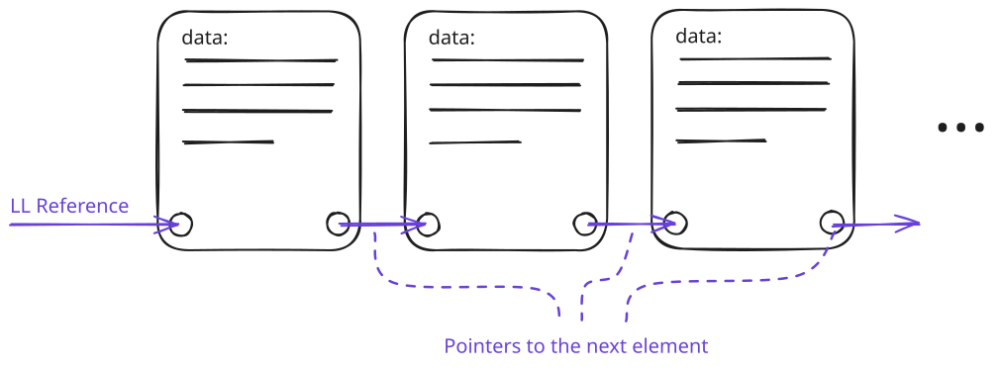
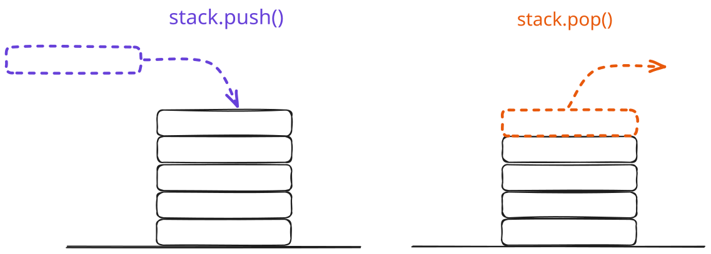
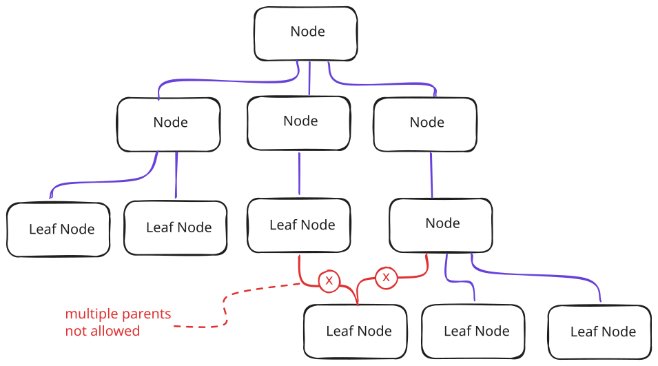

# Software Design CS Fundamentals - Data Structures

A data structure is a way of holding values in memory. Arrays and objects are
the two that web developers use without thinking about it. Both work well for
most everyday work, which is exactly why it is easy to forget that other shapes
exist.

The reason other shapes exist is that the structure you pick decides which
operations are cheap and which are expensive. An array is fast at reading the
value at index 5 and slow at inserting a value at the front. An object is fast
at looking up a key and useless for keeping order. Neither of those is a defect
of arrays or objects. It is a property of how they are laid out in memory and
which operations that layout makes natural.

This section covers three structures that show up under the hood in a lot of
code that web developers do touch: linked lists, stacks, and trees. Each one is
built around an idea about how values relate to each other, and each one makes a
different set of operations cheap.

## Linked lists

A linked list stores values in a chain of nodes. Each node holds a value and a
pointer to the next node. The list itself is just a reference to the first node,
called the head. To find the fifth value, you follow pointers from the head
until you reach it.

This is the opposite trade-off from an array. An array keeps its values in one
contiguous block of memory, so jumping to index 5 is a direct calculation. A
linked list keeps its values scattered, so jumping to the fifth value means
walking past the first four. On the other hand, inserting a value into the
middle of an array means shifting every value after it. Inserting a value into
the middle of a linked list means swapping two pointers, no matter how big the
list is.

A singly linked list has one pointer per node, going forward. A doubly linked
list has two pointers per node, one forward and one back. Doubly linked lists
use more memory but can be walked in either direction, and removing a node is
easier because you can find its predecessor without walking the list from the
head.

Web developers run into linked lists more often than they realize. An undo and
redo history is naturally a doubly linked list: each step points to the one
before and the one after. An LRU cache, the kind a browser or a CDN uses to
evict the least recently used item, is usually built from a hash map paired with
a doubly linked list so that touching an item to mark it as recent is a
constant-time pointer swap.

## Stacks

A stack is a last-in, first-out collection. The most recently added value is the
only one you can read or remove. The two operations have names: push adds a
value on top, and pop removes the value from the top. That is the entire
interface.

The implementation underneath can be an array or a linked list. The point is not
the storage, it is the access pattern. Code that only ever pushes and pops is
using a stack, even if the variable holding it is a plain JavaScript array.

Stacks turn up everywhere once you know to look for them. The call stack is the
runtime's record of which function is currently executing: every call pushes a
frame and every return pops one. The browser's back button is a stack of pages
you have visited. Expression evaluation, the process by which `2 + 3 * 4` is
turned into a single number, is usually done by pushing operands and operators
onto a stack. A depth-first traversal of the DOM uses a stack to remember which
siblings still need to be visited.

Push and pop are both constant-time operations, since they only touch the end of
the structure. That makes stacks an inexpensive choice when the access pattern
fits.

## Trees

A tree is a hierarchical structure. It has a single root node at the top. Each
node can have child nodes, and each child can have its own children. A node with
no children is called a leaf. The depth of a node is how many steps it is from
the root. The height of the tree is the depth of its deepest leaf. Trees are a
special form of Graphs. Neither nodes nor leafs can have multiple parent nodes.
By this rule, loops and merging paths are prevented in the graph.

Trees are the natural shape for hierarchical data, and web developers already
work with several without naming them as trees. The DOM is a tree: the document
is the root, elements are nodes, text nodes are leaves. A file system is a tree:
directories contain other directories or files. JSON is a tree: an object is a
node whose children are its keys and their values, recursively.

Different rules about how children are arranged give different kinds of trees. A
binary tree allows each node at most two children. A binary search tree adds an
ordering rule: every value in the left subtree is less than the node, and every
value in the right subtree is greater.

## Data structures define code bases

When planning an application, one might think that getting the high level
architecture right is the most important step. But in fact it is often the right
data structure for the task that separates codebases the team constantly
struggles with from code that feels natural. Deliberately choosing a good data
structure is one of the key architectural decisions.

## Resources

[MDN: JavaScript data structures](https://developer.mozilla.org/en-US/docs/Web/JavaScript/Data_structures)  
[Wikipedia: Linked list](https://en.wikipedia.org/wiki/Linked_list)  
[Wikipedia: Stack (abstract data type)](<https://en.wikipedia.org/wiki/Stack_(abstract_data_type)>)  
[Wikipedia: Binary search tree](https://en.wikipedia.org/wiki/Binary_search_tree)
